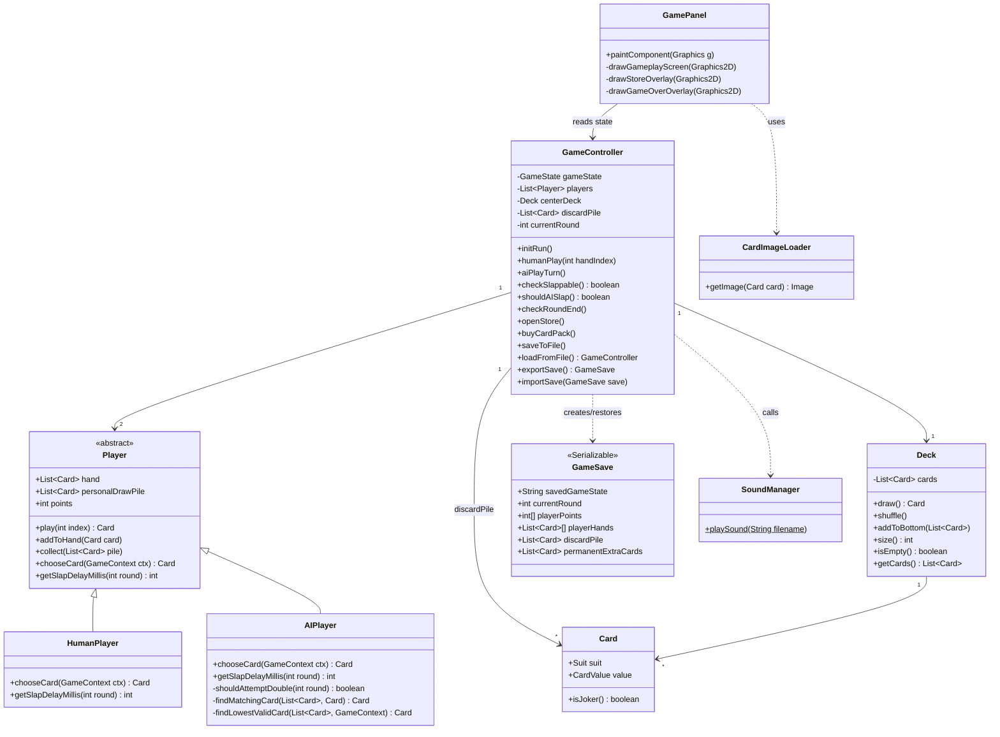
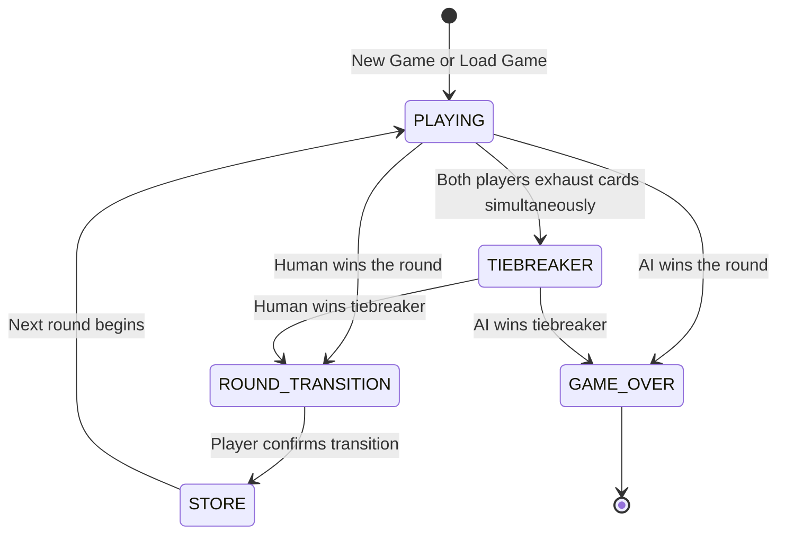
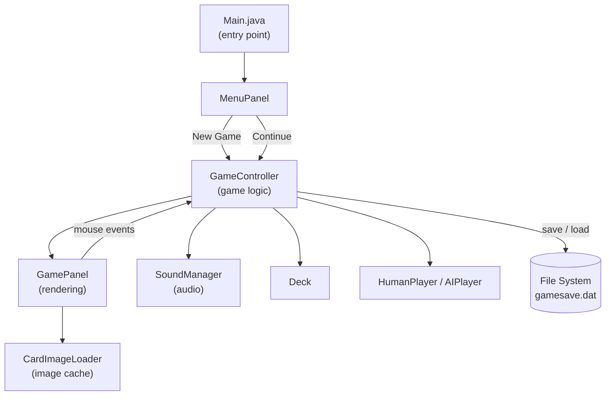
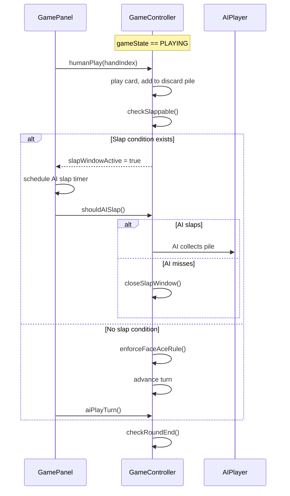

# Design and Architecture

[Back to README](../README.md)

---

## Class Overview

The project uses a straightforward object-oriented structure. `GameController` sits at the center and runs everything. `GamePanel` handles all drawing. `Player` is an abstract class that both `HumanPlayer` and `AIPlayer` extend.

---

## Game State Machine

`GameController` tracks a `GameState` enum that controls what is drawn on screen and what actions are allowed. The state only ever moves in one direction per round.

`GamePanel` reads `gameState` on every repaint and switches between the gameplay screen, store overlay, tiebreaker display, and game-over screen accordingly.

---

## System Design Diagram

The diagram below shows how the major subsystems connect at runtime.

---

## Game Loop

Each turn follows this sequence:

---

## Architecture Decisions

**Why GameController is one large class**

The original CST-451 design planned for separate `SlapDetector` and `RoundManager` classes. During development, slap detection and round-end logic both needed continuous access to the full game state, specifically the discard pile, player hands, and turn counters. Keeping them in `GameController` avoided a web of getters and cross-references that would have made the code harder to follow, not easier. A future refactor could extract those responsibilities once the interfaces are more stable.

**Why Player is abstract**

`HumanPlayer` and `AIPlayer` share the same hand, draw pile, and points bookkeeping. The only things that differ are `chooseCard()` and `getSlapDelayMillis()`. Making `Player` abstract lets `GameController` hold a `List<Player>` and call the same methods on both, without caring which type it is talking to.

**Why GameSave is a separate class**

`GameController` holds Swing timers and a `Random` instance, neither of which can be serialized safely. `GameSave` is a plain data class with no behavior, making it straightforward to serialize and deserialize without side effects. `exportSave()` snapshots the state into a `GameSave`, and `importSave()` reads it back.

---

[Back to README](../README.md) | [Features and Code](features.md) | [Setup](setup.md)
